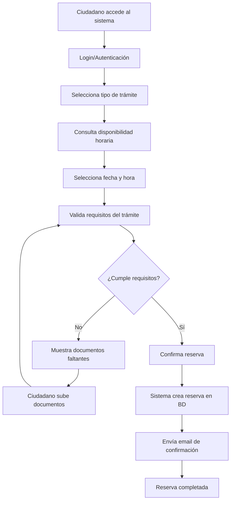
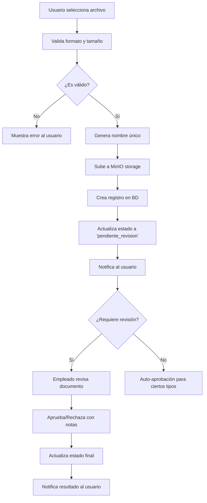
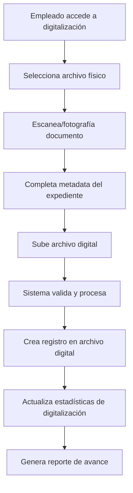
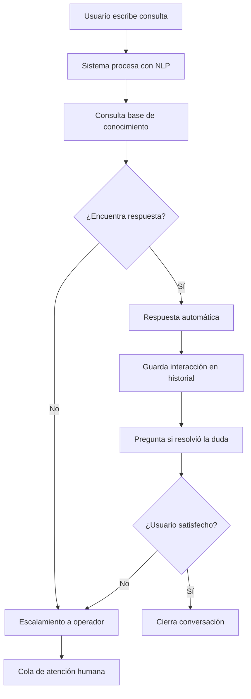

# RESUMEN COMPLETO DE ARQUITECTURA
## Sistema Municipal de Gestión Digital

---

**Fecha:** 11 de Noviembre, 2025  
**Versión:** 1.0  
**Proyecto:** Administración de Redes - U2  

---

## 📋 TABLA DE CONTENIDOS

1. [Visión General del Sistema](#visión-general-del-sistema)
2. [Arquitectura de Microservicios](#arquitectura-de-microservicios)
3. [Servicios del Sistema](#servicios-del-sistema)
4. [Infraestructura y Deployment](#infraestructura-y-deployment)
5. [Base de Datos](#base-de-datos)
6. [Networking y Comunicación](#networking-y-comunicación)
7. [Seguridad y Autenticación](#seguridad-y-autenticación)
8. [Monitoreo y Observabilidad](#monitoreo-y-observabilidad)
9. [Frontend y UX](#frontend-y-ux)
10. [APIs y Endpoints](#apis-y-endpoints)
11. [Flujos de Trabajo](#flujos-de-trabajo)
12. [Configuración y Variables](#configuración-y-variables)

---

## 🏗️ VISIÓN GENERAL DEL SISTEMA

### Propósito
Sistema integral para la gestión municipal que permite:
- **Reservas de citas** para trámites municipales
- **Digitalización de documentos** ciudadanos
- **Gestión de datos municipales** (licencias, permisos, multas)
- **Chatbot inteligente** para asistencia ciudadana
- **Panel administrativo** completo

### Arquitectura Principal
```
┌─────────────────┐    ┌─────────────────┐    ┌─────────────────┐
│   CIUDADANOS    │    │  EMPLEADOS      │    │ ADMINISTRADORES │
│   (Frontend)    │    │  (Frontend)     │    │   (Frontend)    │
└─────────┬───────┘    └─────────┬───────┘    └─────────┬───────┘
          │                      │                      │
          └──────────────────────┼──────────────────────┘
                                 │
                    ┌────────────▼────────────┐
                    │     API GATEWAY        │
                    │      (nginx)           │
                    └────────────┬────────────┘
                                 │
          ┌──────────────────────┼──────────────────────┐
          │                      │                      │
    ┌─────▼─────┐          ┌─────▼─────┐          ┌─────▼─────┐
    │   AUTH    │          │DOCUMENTS  │          │RESERVAS   │
    │ SERVICE   │          │ SERVICE   │          │ SERVICE   │
    └───────────┘          └───────────┘          └───────────┘
          │                      │                      │
    ┌─────▼─────┐          ┌─────▼─────┐          ┌─────▼─────┐
    │  AUTH DB  │          │  DOCS DB  │          │RESERVAS DB│
    └───────────┘          └───────────┘          └───────────┘
```

---

## 🔧 ARQUITECTURA DE MICROSERVICIOS

### Principios de Diseño
- **Separación de responsabilidades** por dominio
- **Escalabilidad horizontal** independiente
- **Tolerancia a fallos** con circuit breakers
- **Comunicación asíncrona** donde sea posible
- **Datos descentralizados** por servicio

### Patrones Implementados
- **API Gateway Pattern** - Punto de entrada único
- **Service Discovery** - Resolución dinámica de servicios
- **Database per Service** - Cada servicio tiene su BD
- **Event Sourcing** - Para auditoría de cambios
- **CQRS** - Separación comando/consulta donde aplique

---

## 🚀 SERVICIOS DEL SISTEMA

### 1. API Gateway (nginx)
```yaml
Puerto: 8081
Tecnología: nginx 1.25.5
Función: Routing, Load Balancing, SSL Termination
```

**Responsabilidades:**
- Enrutamiento de requests a servicios backend
- Load balancing entre instancias
- Manejo de CORS y headers de seguridad
- SSL termination y compresión
- Rate limiting y caching

**Configuración clave:**
```nginx
upstream auth_cluster {
    server auth-service-1:8000;
    server auth-service-2:8000;
}

upstream reservations_cluster {
    server reservations-service-1:8002;
    server reservations-service-2:8002;
}

upstream documents_cluster {
    server documents-service:8003;
}
```

### 2. Auth Service (FastAPI + PostgreSQL)
```yaml
Puerto: 8000 (2 instancias)
Tecnología: Python 3.11, FastAPI, SQLModel
Base de Datos: PostgreSQL con replicación
```

**Responsabilidades:**
- Autenticación JWT con RS256
- Gestión de usuarios (ciudadanos, empleados, admin)
- Autorización basada en roles (RBAC)
- Simulador de datos municipales
- Consultas a sistemas externos

**Endpoints principales:**
- `POST /token` - Login y obtención de JWT
- `GET /users/me` - Información del usuario actual
- `POST /admin/employees` - Registro de empleados
- `GET /consultar-datos-municipales` - Datos municipales

**Modelo de datos:**
```python
class User(SQLModel, table=True):
    id: Optional[int] = Field(primary_key=True)
    username: str = Field(unique=True)
    email: str = Field(unique=True)
    nombre: str
    password: str  # Hasheada con bcrypt
    rut: str = Field(unique=True)
    role: str = "user"  # user, employee, admin
    activo: bool = True
```

### 3. Documents Service (FastAPI + PostgreSQL + MinIO)
```yaml
Puerto: 8003
Tecnología: Python 3.11, FastAPI, SQLModel
Storage: MinIO para archivos
Base de Datos: PostgreSQL
```

**Responsabilidades:**
- Upload y gestión de documentos ciudadanos
- Digitalización de documentos antiguos
- Validación y procesamiento de archivos
- Generación de reportes de digitalización
- Gestión de estados de documentos

**Endpoints principales:**
- `POST /upload-documento` - Subir documento ciudadano
- `GET /documentos/usuario/{id}` - Documentos de usuario
- `POST /documentos-antiguos` - Digitalizar documento antiguo
- `GET /reportes/digitalizacion/diario` - Reportes

**Modelos de datos:**
```python
class DocumentoCiudadano(SQLModel, table=True):
    id: Optional[int] = Field(primary_key=True)
    reserva_id: Optional[int] = None
    usuario_id: int
    usuario_rut: str
    tipo_documento: Optional[str] = None
    nombre_archivo: str
    ruta_archivo: str
    tamano_bytes: int
    mime_type: str
    estado: str = "pendiente_revision"
    digitalizado_por: Optional[int] = None
    fecha_carga: datetime
```

### 4. Reservations Service (FastAPI + PostgreSQL)
```yaml
Puerto: 8002 (2 instancias con HA)
Tecnología: Python 3.11, FastAPI, SQLModel
Base de Datos: PostgreSQL con replicación
```

**Responsabilidades:**
- Gestión de reservas de citas
- Validación de disponibilidad horaria
- Requisitos por tipo de trámite
- Notificaciones automáticas
- Gestión de calendario municipal

**Endpoints principales:**
- `POST /reservations` - Crear nueva reserva
- `GET /reservations/user/{id}` - Reservas de usuario
- `GET /check-availability` - Verificar disponibilidad
- `POST /validar-requisitos-tramite` - Validar requisitos

### 5. AI Service / Chatbot (FastAPI + Ollama)
```yaml
Puerto: 8005
Tecnología: Python 3.11, FastAPI, Ollama
LLM: llama3.2:1b
```

**Responsabilidades:**
- Procesamiento de lenguaje natural
- Respuestas automáticas a consultas
- Base de conocimiento municipal
- Historial de conversaciones
- Escalamiento a operadores humanos

### 6. Notifications Service (FastAPI + Celery + Redis)
```yaml
Puerto: 8004
Tecnología: Python 3.11, FastAPI, Celery
Queue: Redis
Email: SMTP configurado
```

**Responsabilidades:**
- Envío de emails transaccionales
- Notificaciones push (futuro)
- Templates HTML para emails
- Cola de trabajo asíncrona
- Reintento automático de fallos

### 7. Datos Municipalidad Service
```yaml
Puerto: 8006
Tecnología: Python 3.11, FastAPI
Función: Simulador de sistemas municipales
```

**Responsabilidades:**
- Simulación de consultas a sistemas legacy
- Datos de edificaciones y permisos
- Patentes comerciales
- Multas del JPL
- API unificada para datos municipales

### 8. Frontend (React + nginx)
```yaml
Puerto: 3000
Tecnología: React 18, Vite, Tailwind CSS
Servidor: nginx 1.25.5
```

**Responsabilidades:**
- Interfaz de usuario responsive
- Gestión de estado con React hooks
- Routing cliente-side
- Proxy a APIs backend
- Autenticación JWT en frontend

---

## 🗄️ BASE DE DATOS

### Arquitectura de Datos
```
┌─────────────────┐    ┌─────────────────┐    ┌─────────────────┐
│    AUTH_DB      │    │   DOCUMENTS_DB  │    │ RESERVATIONS_DB │
│   (Primary)     │    │   (Primary)     │    │   (Primary)     │
│                 │    │                 │    │                 │
│   auth_db_rep   │    │      N/A        │    │ reservations_   │
│   (Replica)     │    │                 │    │ db_replica      │
└─────────────────┘    └─────────────────┘    └─────────────────┘

┌─────────────────┐
│   CHATBOT_DB    │
│   (Primary)     │
│                 │
└─────────────────┘
```

### Configuración de PostgreSQL
- **Versión:** PostgreSQL 16.4
- **Replicación:** Streaming replication para HA
- **Backup:** Automático con pg_backup service
- **Monitoring:** postgres_exporter para Prometheus

### Esquemas principales:

#### Auth Database
```sql
-- Usuarios del sistema
CREATE TABLE users (
    id SERIAL PRIMARY KEY,
    username VARCHAR UNIQUE NOT NULL,
    email VARCHAR UNIQUE NOT NULL,
    nombre VARCHAR NOT NULL,
    password VARCHAR NOT NULL,
    rut VARCHAR UNIQUE NOT NULL,
    role VARCHAR DEFAULT 'user',
    activo BOOLEAN DEFAULT TRUE,
    fecha_creacion TIMESTAMP DEFAULT NOW()
);

-- Datos municipales simulados
CREATE TABLE datos_municipales (
    id SERIAL PRIMARY KEY,
    rut VARCHAR NOT NULL,
    tipo_consulta VARCHAR NOT NULL,
    datos JSONB,
    fecha_consulta TIMESTAMP DEFAULT NOW()
);
```

#### Documents Database
```sql
-- Documentos de ciudadanos
CREATE TABLE documentos_ciudadano (
    id SERIAL PRIMARY KEY,
    reserva_id INTEGER,
    usuario_id INTEGER NOT NULL,
    usuario_rut VARCHAR NOT NULL,
    tipo_documento VARCHAR,
    nombre_archivo VARCHAR NOT NULL,
    ruta_archivo VARCHAR NOT NULL,
    tamano_bytes INTEGER NOT NULL,
    mime_type VARCHAR NOT NULL,
    estado VARCHAR DEFAULT 'pendiente_revision',
    notas TEXT,
    digitalizado_por INTEGER,
    revisado_por INTEGER,
    fecha_carga TIMESTAMP DEFAULT NOW(),
    fecha_revision TIMESTAMP
);

-- Documentos antiguos del archivo
CREATE TABLE documentos_antiguos (
    id SERIAL PRIMARY KEY,
    numero_expediente VARCHAR NOT NULL,
    ciudadano_rut VARCHAR,
    ciudadano_nombre VARCHAR,
    tipo_tramite VARCHAR NOT NULL,
    año_tramite INTEGER NOT NULL,
    descripcion TEXT NOT NULL,
    numero_fojas INTEGER DEFAULT 1,
    nombre_archivo VARCHAR NOT NULL,
    ruta_archivo VARCHAR NOT NULL,
    tamano_bytes INTEGER NOT NULL,
    mime_type VARCHAR NOT NULL,
    digitalizado_por INTEGER NOT NULL,
    fecha_digitalizacion TIMESTAMP DEFAULT NOW()
);

-- Registro de digitalizaciones
CREATE TABLE registro_digitalizacion (
    id SERIAL PRIMARY KEY,
    digitalizador_id INTEGER NOT NULL,
    tipo_documento VARCHAR NOT NULL,
    documento_id INTEGER NOT NULL,
    accion VARCHAR NOT NULL,
    fecha_accion TIMESTAMP DEFAULT NOW(),
    notas TEXT
);
```

#### Reservations Database
```sql
-- Reservas de citas
CREATE TABLE reservations (
    id SERIAL PRIMARY KEY,
    user_id INTEGER NOT NULL,
    user_name VARCHAR NOT NULL,
    user_rut VARCHAR NOT NULL,
    user_email VARCHAR NOT NULL,
    tramite_tipo VARCHAR NOT NULL,
    fecha_cita DATE NOT NULL,
    hora_cita TIME NOT NULL,
    estado VARCHAR DEFAULT 'confirmada',
    notas TEXT,
    fecha_creacion TIMESTAMP DEFAULT NOW(),
    fecha_modificacion TIMESTAMP DEFAULT NOW()
);

-- Requisitos por trámite
CREATE TABLE requisitos_tramites (
    id SERIAL PRIMARY KEY,
    tipo_tramite VARCHAR NOT NULL,
    requisitos JSONB NOT NULL,
    activo BOOLEAN DEFAULT TRUE
);
```

---

## 🌐 NETWORKING Y COMUNICACIÓN

### Docker Networks
```yaml
Networks:
  - proyecto_network (custom bridge)
    - Subnet: 172.19.0.0/16
    - Gateway: 172.19.0.1
    - DNS: Docker embedded DNS

Service Discovery:
  - Docker DNS resolver (127.0.0.11)
  - Service names as hostnames
  - Health checks para routing
```

### Puertos y Exposición
```yaml
External Ports:
  - 3000: Frontend (React)
  - 8081: API Gateway (nginx)
  - 5432-5436: PostgreSQL databases
  - 6379: Redis
  - 9000-9001: MinIO
  - 11434: Ollama
  - 3001: Grafana
  - 9090: Prometheus

Internal Ports:
  - 8000: Auth services
  - 8002: Reservations services  
  - 8003: Documents service
  - 8004: Notifications service
  - 8005: Chatbot service
  - 8006: Datos municipalidad service
```

### Load Balancing
```nginx
# Auth Service (Round Robin)
upstream auth_cluster {
    server auth-service-1:8000;
    server auth-service-2:8000;
}

# Reservations Service (Round Robin)
upstream reservations_cluster {
    server reservations-service-1:8002;
    server reservations-service-2:8002;
}

# Documents Service (Single instance)
upstream documents_cluster {
    server documents-service:8003;
}
```

---

## 🔐 SEGURIDAD Y AUTENTICACIÓN

### JWT Authentication
```yaml
Algorithm: RS256 (RSA with SHA-256)
Token Expiry: 24 hours
Refresh: Not implemented (re-login required)
Storage: localStorage (frontend)
Headers: Authorization: Bearer <token>
```

### Role-Based Access Control (RBAC)
```yaml
Roles:
  - user: Ciudadanos regulares
    - Ver sus reservas
    - Crear reservas
    - Subir documentos
    - Usar chatbot
    
  - employee: Empleados municipales
    - Todo lo de user
    - Revisar documentos
    - Digitalizar archivos antiguos
    - Ver reportes básicos
    
  - admin: Administradores
    - Todo lo anterior
    - Gestión de usuarios
    - Reportes completos
    - Configuración del sistema
```

### Endpoints protegidos
```python
# Decorador para protección
@app.get("/protected-endpoint")
async def protected_route(
    current_user: dict = Depends(get_current_user)
):
    # Solo usuarios autenticados

@app.get("/admin-only")  
async def admin_route(
    current_user: dict = Depends(require_role(["admin"]))
):
    # Solo administradores
```

### CORS y Headers de Seguridad
```nginx
add_header 'Access-Control-Allow-Origin' '*' always;
add_header 'Access-Control-Allow-Methods' 'GET, POST, PUT, DELETE, OPTIONS, PATCH' always;
add_header 'Access-Control-Allow-Headers' 'DNT,User-Agent,X-Requested-With,If-Modified-Since,Cache-Control,Content-Type,Range,Authorization' always;
add_header 'X-Frame-Options' 'SAMEORIGIN' always;
add_header 'X-Content-Type-Options' 'nosniff' always;
add_header 'X-XSS-Protection' '1; mode=block' always;
add_header 'Content-Security-Policy' "default-src 'self' 'unsafe-inline' data:;" always;
```

---

## 📊 MONITOREO Y OBSERVABILIDAD

### Stack de Monitoreo
```yaml
Prometheus: Métricas y alertas
  - Puerto: 9090
  - Retention: 15 días
  - Scrape interval: 15s

Grafana: Dashboards y visualización
  - Puerto: 3001
  - Usuario: admin/admin123
  - Dashboards: Sistema, Base de datos, Aplicación

Alertmanager: Gestión de alertas
  - Puerto: 9093
  - Canales: Email (configurable)
  - Reglas: CPU, memoria, disco, latencia

Node Exporter: Métricas del sistema
  - Puerto: 9100
  - CPU, memoria, disco, red

PostgreSQL Exporter: Métricas de BD
  - Puertos: 9187-9190
  - Conexiones, queries, locks, replicación

Redis Exporter: Métricas de Redis
  - Puerto: 9121
  - Memoria, comandos, clientes
```

### Health Checks
```yaml
Service Health Endpoints:
  - /health (todos los servicios)
  - /metrics (Prometheus)
  - Docker HEALTHCHECK directives

Database Health:
  - Connection pooling status
  - Replication lag monitoring
  - Query performance tracking

Application Metrics:
  - Request rate y latencia
  - Error rate por endpoint
  - User sessions activas
  - Document upload success rate
```

### Alerting Rules
```yaml
Critical Alerts:
  - Service down > 1 minuto
  - Database connection failure
  - High error rate > 5%
  - CPU usage > 80%
  - Memory usage > 90%
  - Disk space < 10%

Warning Alerts:
  - Response time > 2s
  - Replication lag > 30s
  - Queue depth > 100 items
  - Failed login attempts > 10/min
```

---

## 💻 FRONTEND Y UX

### Tecnologías Frontend
```yaml
Framework: React 18.2.0
Build Tool: Vite 5.x
Styling: Tailwind CSS 3.x
State Management: React hooks (useState, useEffect)
HTTP Client: Axios
Router: React Router (implied)
Server: nginx 1.25.5-alpine
```

### Componentes principales
```
src/
├── components/
│   ├── AdminDashboard.jsx      # Dashboard administrativo
│   ├── AdminReports.jsx        # Reportes para admin
│   ├── AdminReservations.jsx   # Gestión de reservas
│   ├── ChatBotWidget.jsx       # Widget del chatbot
│   ├── DocumentsComponent.jsx  # Gestión de documentos
│   ├── ReservationForm.jsx     # Formulario de reservas
│   └── layout/
│       ├── Header.jsx          # Navegación principal  
│       └── Footer.jsx          # Pie de página
├── services/
│   ├── authAPI.js              # Servicios de autenticación
│   ├── reservationAPI.js       # Servicios de reservas
│   ├── digitalizadorAPI.js     # Servicios de documentos
│   └── chatbotAPI.js           # Servicios del chatbot
└── pages/
    ├── Login.jsx               # Página de login
    ├── Menu.jsx                # Menú principal
    ├── Reservas.jsx            # Gestión de reservas
    └── Register.jsx            # Registro de usuarios
```

### Flujos de Usuario

#### Ciudadano Regular:
1. **Login** → Autenticación JWT
2. **Dashboard** → Ver resumen de servicios
3. **Reservas** → Agendar/ver citas
4. **Documentos** → Subir/ver documentos
5. **Chatbot** → Asistencia automática

#### Empleado Municipal:
1. **Login** → Autenticación con rol employee
2. **Dashboard** → Vista de trabajo diario
3. **Digitalización** → Procesar archivos antiguos
4. **Revisión** → Aprobar/rechazar documentos
5. **Reportes** → Estadísticas de trabajo

#### Administrador:
1. **Login** → Acceso completo al sistema
2. **Panel Admin** → Gestión completa
3. **Usuarios** → Crear empleados, gestionar accesos
4. **Reportes** → Analytics completos del sistema
5. **Configuración** → Parámetros del sistema

---

## 🔌 APIS Y ENDPOINTS

### Auth Service API
```yaml
Authentication:
  POST /token
    Body: {identifier: str, password: str, login_type: str}
    Response: {access_token: str, token_type: str}

User Management:
  GET /users/me
    Headers: Authorization: Bearer <token>
    Response: {id, username, email, nombre, role}
  
  POST /admin/employees
    Body: {username, email, nombre, password, rut}
    Response: {success: bool, user_id: int}

Municipal Data:
  GET /consultar-datos-municipales
    Params: {rut: str, tipo: str}
    Response: {data: objeto, success: bool}

Health:
  GET /health
    Response: {status: "healthy", timestamp: datetime}
```

### Documents Service API  
```yaml
Document Upload:
  POST /upload-documento
    Form: {file: File, reserva_id?: int, tipo_documento?: str}
    Response: {success: bool, documento_id: int}

Document Management:
  GET /documentos/usuario/{user_id}
    Response: {documentos: [array]}
  
  GET /documentos/reserva/{reserva_id}
    Response: {documentos: [array]}

Legacy Digitization:
  POST /documentos-antiguos
    Form: {file: File, metadata: objeto}
    Response: {success: bool, documento_id: int}

Reports:
  GET /reportes/digitalizacion/diario
    Params: {fecha: date}
    Response: {stats: objeto, documentos: [array]}
```

### Reservations Service API
```yaml
Reservation Management:
  POST /reservations
    Body: {tramite_tipo, fecha_cita, hora_cita, ...}
    Response: {success: bool, reserva_id: int}
  
  GET /reservations/user/{user_id}
    Response: {reservations: [array]}

Availability:
  GET /check-availability/{fecha}/{hora}/{tipo_tramite}
    Response: {available: bool, conflictos: [array]}

Validation:
  POST /validar-requisitos-tramite
    Body: {tipo_tramite: str, documentos_subidos: [array]}
    Response: {cumple_requisitos: bool, faltantes: [array]}
```

---

## 🔄 FLUJOS DE TRABAJO

### Flujo de Reserva de Cita


### Flujo de Subida de Documentos


### Flujo de Digitalización de Archivos Antiguos


### Flujo del Chatbot


---

## ⚙️ CONFIGURACIÓN Y VARIABLES

### Variables de Entorno (.env)
```bash
# Database Configuration
AUTH_DB_USER=auth_user
AUTH_DB_PASSWORD=auth_secure_pass_2025
AUTH_DB_NAME=auth_db

DOCUMENTS_DB_USER=documents_user
DOCUMENTS_DB_PASSWORD=documents_secure_pass_2025
DOCUMENTS_DB_NAME=documents_db

RESERVATIONS_DB_USER=reservations_user
RESERVATIONS_DB_PASSWORD=reservations_secure_pass_2025
RESERVATIONS_DB_NAME=reservations_db

CHATBOT_DB_USER=chatbot_user
CHATBOT_DB_PASSWORD=chatbot_secure_pass_2025
CHATBOT_DB_NAME=chatbot_db

# JWT Configuration
JWT_SECRET_KEY=super-secret-jwt-key-for-proyecto-municipal-2025
JWT_ALGORITHM=HS256
JWT_ACCESS_TOKEN_EXPIRE_MINUTES=1440

# MinIO Configuration
MINIO_ROOT_USER=minio_admin
MINIO_ROOT_PASSWORD=minio_password_2025
MINIO_BUCKET=documentos

# Redis Configuration
REDIS_URL=redis://redis:6379/0

# Email Configuration
SMTP_HOST=smtp.gmail.com
SMTP_PORT=587
SMTP_USERNAME=tu-email@gmail.com
SMTP_PASSWORD=tu-app-password
EMAIL_FROM=noreply@municipalidad.cl

# API Gateway
GATEWAY_PORT=8081

# Frontend
FRONTEND_PORT=3000

# Monitoring
GRAFANA_ADMIN_PASSWORD=admin123
```

### Docker Compose Structure
```yaml
version: '3.8'

services:
  # Frontend
  frontend:
    build: ./services/frontend
    ports: ["3000:80"]
    depends_on: [gateway]
    
  # API Gateway  
  gateway:
    build: ./services/api-gateway
    ports: ["8081:80"]
    depends_on: [auth-service-1, documents-service, reservations-service-1]
    
  # Auth Services (HA)
  auth-service-1:
    build: ./services/auth-service
    depends_on: [auth-db]
    
  auth-service-2:
    build: ./services/auth-service  
    depends_on: [auth-db]
    
  # Database Services
  auth-db:
    image: postgres:16.4
    environment:
      POSTGRES_DB: ${AUTH_DB_NAME}
      POSTGRES_USER: ${AUTH_DB_USER}
      POSTGRES_PASSWORD: ${AUTH_DB_PASSWORD}
    volumes:
      - auth_db_data:/var/lib/postgresql/data
    ports: ["5432:5432"]
    
  # Storage
  minio:
    image: minio/minio:RELEASE.2024-07-26T20-48-21Z
    environment:
      MINIO_ROOT_USER: ${MINIO_ROOT_USER}
      MINIO_ROOT_PASSWORD: ${MINIO_ROOT_PASSWORD}
    ports: ["9000:9000", "9001:9001"]
    volumes:
      - minio_data:/data
      
  # Monitoring
  prometheus:
    image: prom/prometheus:v2.49.0
    ports: ["9090:9090"]
    
  grafana:
    image: grafana/grafana:9.5.8  
    ports: ["3001:3000"]
    environment:
      - GF_SECURITY_ADMIN_PASSWORD=${GRAFANA_ADMIN_PASSWORD}

networks:
  proyecto_network:
    driver: bridge

volumes:
  auth_db_data:
  documents_db_data:  
  reservations_db_data:
  chatbot_db_data:
  minio_data:
  prometheus_data:
  grafana_data:
```

---

## 📈 MÉTRICAS Y KPIs

### Métricas Técnicas
- **Uptime:** > 99.5%
- **Response time:** < 2s promedio
- **Error rate:** < 1%
- **Throughput:** 100 requests/segundo
- **Database connections:** < 80% del pool

### Métricas de Negocio
- **Reservas por día:** Tracking diario
- **Documentos procesados:** Por empleado/día
- **Satisfacción del chatbot:** % de consultas resueltas
- **Tiempo de digitalización:** Promedio por documento
- **Adoption rate:** Usuarios activos vs registrados

---

## 🚀 DEPLOYMENT Y OPERACIONES

### Proceso de Deployment
```bash
# 1. Build de imágenes
docker compose build

# 2. Deploy con rolling update
docker compose up -d --scale auth-service=2 --scale reservations-service=2

# 3. Health check
./test_system_health.sh

# 4. Smoke tests
./smoke_test_endpoints.sh
```

### Backup Strategy
- **Base de datos:** Backup automático diario con pg_backup
- **Documentos:** Replicación en MinIO con versioning
- **Configuración:** Git repository con todas las configs
- **Monitoring data:** Retention de 30 días en Prometheus

### Disaster Recovery
- **RTO:** 4 horas (Recovery Time Objective)
- **RPO:** 1 hora (Recovery Point Objective)  
- **Backup location:** Almacenamiento externo
- **Procedure:** Documentado en DISASTER_RECOVERY.md

---

## 🔮 ROADMAP Y MEJORAS FUTURAS

### Corto Plazo (3 meses)
- [ ] Notificaciones push en navegador
- [ ] Cache con Redis para consultas frecuentes
- [ ] Rate limiting por usuario
- [ ] Logging centralizado con ELK Stack

### Mediano Plazo (6 meses)  
- [ ] Mobile app (React Native)
- [ ] Single Sign-On (SSO) con sistemas municipales
- [ ] ML para categorización automática de documentos
- [ ] Dashboard analítico avanzado

### Largo Plazo (12+ meses)
- [ ] Migración a Kubernetes
- [ ] CI/CD completo con GitLab
- [ ] Inteligencia artificial para predicción de demanda
- [ ] Blockchain para trazabilidad de documentos

---

## 📞 CONTACTO Y SOPORTE

### Equipo de Desarrollo
- **Arquitecto de Sistema:** [Nombre]
- **DevOps Engineer:** [Nombre]  
- **Frontend Developer:** [Nombre]
- **Backend Developer:** [Nombre]

### Documentación Adicional
- `README.md` - Guía de inicio rápido
- `docs/arquitectura.md` - Detalles técnicos
- `DEPLOYMENT_GUIDE.md` - Guía de deployment
- `API_DOCUMENTATION.md` - Documentación completa de APIs

---

**Fin del Documento**

*Generado el 11 de Noviembre, 2025*  
*Versión 1.0*