# Hardening

## Hardening nivel 1 usuarios no root y  ́imagenes base con versiones  especificas:

### Dockerfiles modificados en cada servicio

#### ia-service modificada 
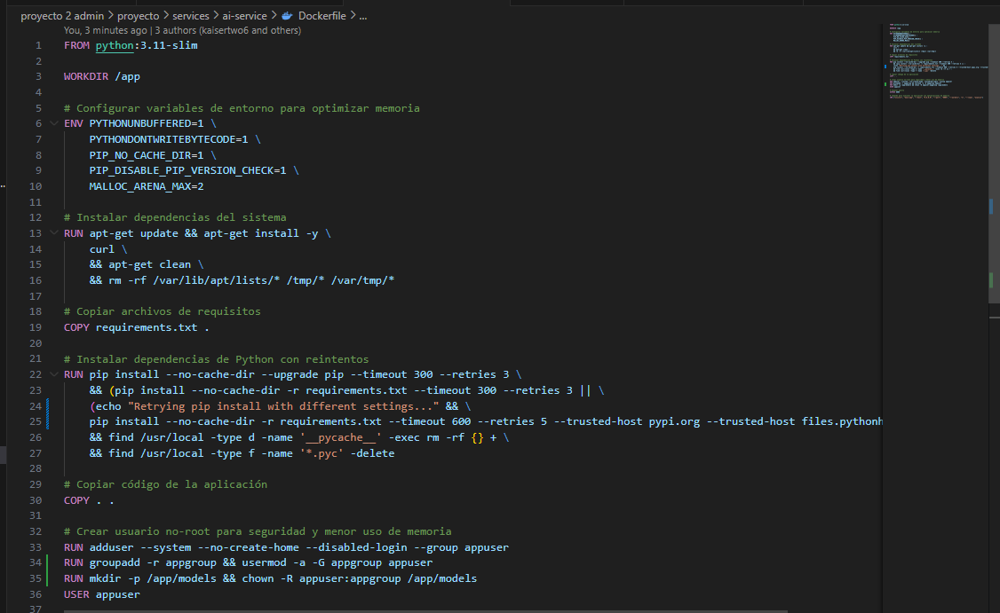
como se puede ver se el usuario no root es appuser el nuevo, ademas se ajusto la imagen a la version slim de python python:3.11.9-slim. dentro de los archivos se agrego el comando chown:
```
RUN groupadd -r appgroup && usermod -a -G appgroup appuser
RUN mkdir -p /app/models && chown -R appuser:appgroup /app/models
```
se cambiaron los permisos de los archivos y directorios models porque la ia necesita escribir en ellos , haciendo que solo ella tenga acceso a ellos

#### api-geteway modificada 
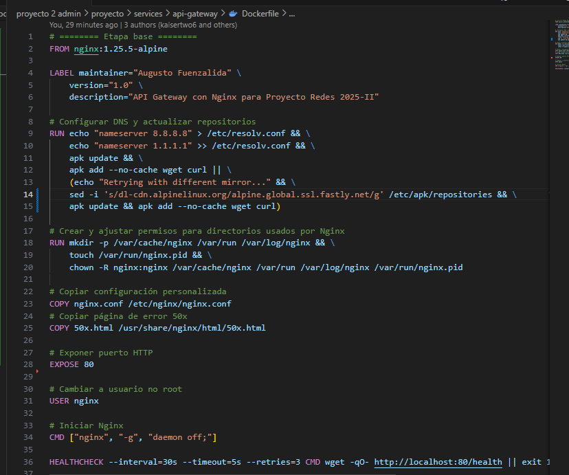
como se puede ver se el usuario no root es nginx el nuevo, ademas se ajusto la imagen a la version alpine para menor consumo de ram y menor consumo de espacio en disco nginx:1.25.5-alpine, junto con todo lo demas se agrego el comando chown:
```
chown -R nginx:nginx /var/cache/nginx /var/run /var/log/nginx /var/run/nginx.pid
```
esto permite que el proceso se ejecute como el usuario nginx en vez de root

#### auth-service modificada 

como se puede ver se el usuario no root es appuser el nuevo, ademas se ajusto la imagen a la version slim de python python:3.11.9-slim. dentro de los archivos se agrego el comando chown:
```
RUN useradd --system --no-create-home appuser && chown -R appuser /app
```
con esto cubrimos cualquier directorio que se cree bajo /app

#### datos-municipalidad-service modificada
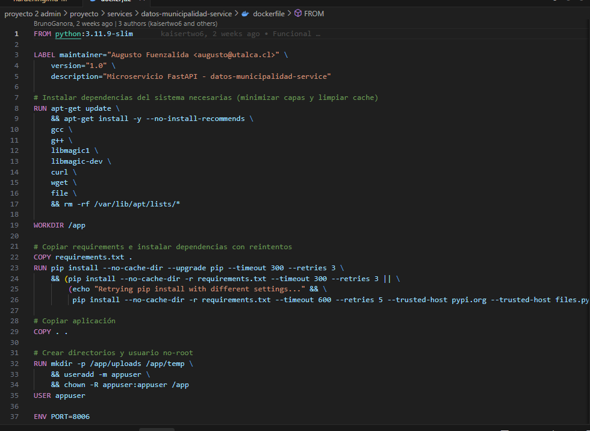
como se puede ver se el usuario no root es appuser el nuevo, ademas se ajusto la imagen a la version slim de python python:3.11.9-slim. dentro de los archivos se agrego el comando chown:
```
RUN mkdir -p /app/uploads /app/temp \
    && useradd -m appuser \
    && chown -R appuser:appuser /app
USER appuser
```
Este bloque crea un usuario sin privilegios, le asigna la propiedad de los directorios críticos y hace que todo el contenedor se ejecute bajo ese usuario, lo que limita el daño que un atacante podría causar si compromete la aplicación

#### documents‑service modificada
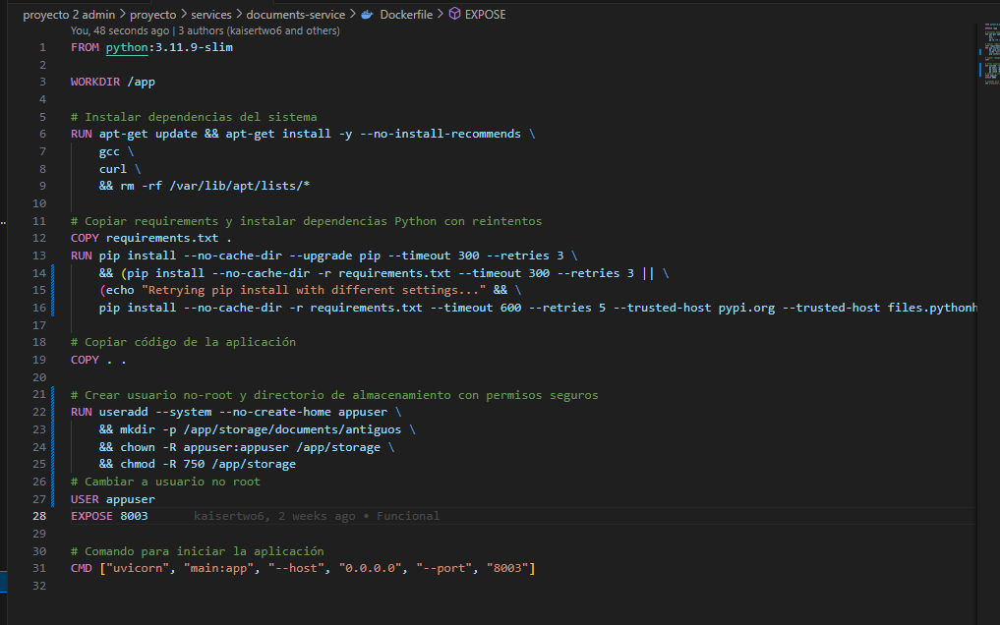
En este bloque al igual que los demas se encuentra la version slim de python python:3.11.9-slim, tanto como el usuario no root es appuser y el comando chown:
```
RUN useradd --system --no-create-home appuser \
    && mkdir -p /app/storage/documents/antiguos \
    && chown -R appuser:appuser /app/storage \
    && chmod -R 750 /app/storage
```
con esto cubrimos cualquier acceso no adminito a los archivos de la carpeta storage 

#### frontend modificado 
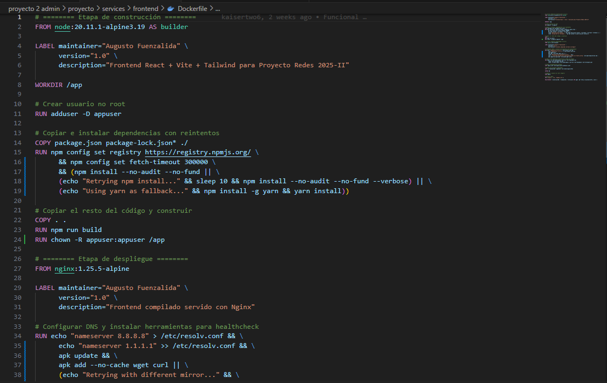

En este Dockerfile se aplica el hardening creando un usuario no‑root y asignando la propiedad del directorio de la aplicación:

```dockerfile
# Crear usuario no‑root
RUN adduser -D appuser

# Asignar ownership al directorio de la aplicación (después de la compilación)
RUN chown -R appuser:appuser /app
```

- **`adduser -D appuser`** crea la cuenta *appuser* sin contraseña, evitando que el proceso se ejecute como root.
- **`chown -R appuser:appuser /app`** garantiza que solo este usuario pueda leer/escribir los archivos estáticos generados en la fase de *builder*.

#### notificacion-service modificada
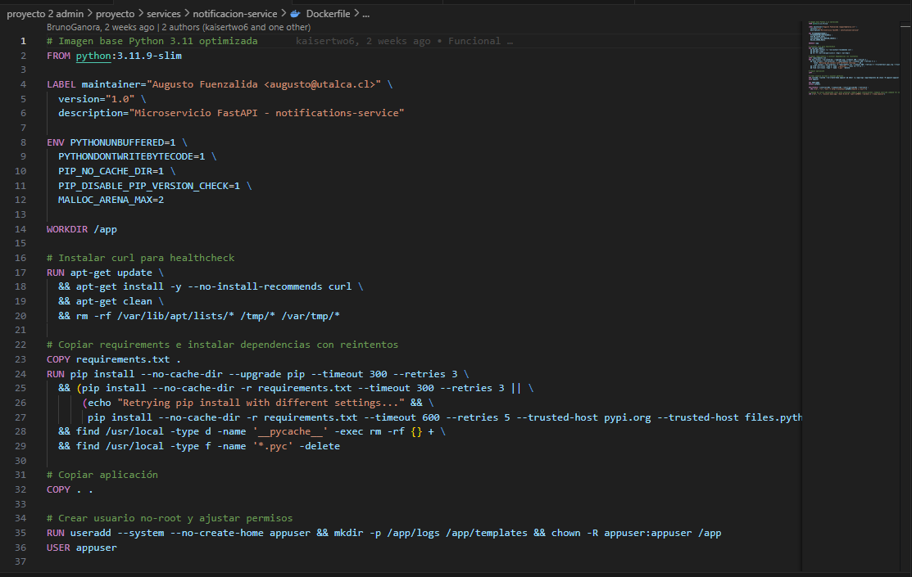

En este Dockerfile se ah creando un usuario no‑root y asignando la propiedad del directorio de la aplicación:

```dockerfile
# Crear usuario no‑root y asignar ownership
RUN useradd --system --no-create-home appuser \
    && mkdir -p /app/logs /app/templates \
    && chown -R appuser:appuser /app

# Cambiar a usuario no root
USER appuser
```

- **`useradd --system --no-create-home appuser`** crea la cuenta de servicio sin contraseña ni home.
- **`chown -R appuser:appuser /app`** asegura que solo este usuario pueda leer/escribir los archivos de la aplicación.
- **`USER appuser`** ejecuta el proceso bajo un usuario sin privilegios.

#### reservation-service modificada
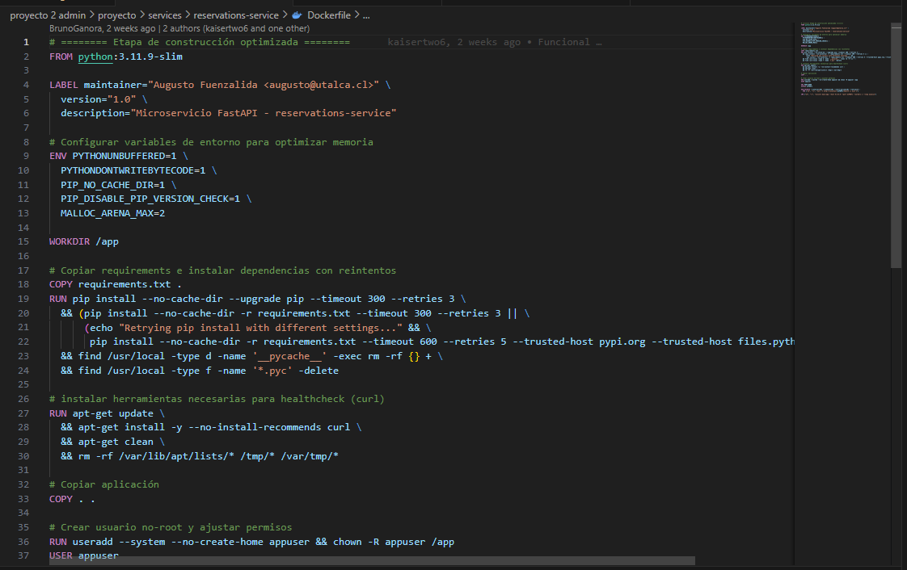

En este Contenedor se aplica el hardening creando un usuario no‑root, un grupo dedicado y asignando ownership con permisos restrictivos:

```dockerfile
# Crear usuario no‑root, grupo y asignar ownership con permisos seguros
RUN groupadd -r appgroup && \
    useradd --system --no-create-home -G appgroup appuser && \
    chown -R appuser:appgroup /app && \
    chmod -R 750 /app

USER appuser
```

- **`groupadd -r appgroup`** crea un grupo de sistema para aislar permisos.
- **`useradd --system --no-create-home -G appgroup appuser`** crea la cuenta de servicio sin contraseña y la asocia al grupo.
- **`chown -R appuser:appgroup /app`** asegura que solo el usuario y su grupo tengan acceso a los archivos.
- **`chmod -R 750 /app`** restringe los permisos a propietario y grupo, prohibiendo acceso a “otros”.
- **`USER appuser`** ejecuta la aplicación bajo un usuario sin privilegios.

##### servicios restantes
#### infrastructure 

#### reservations-replica dockerfile 
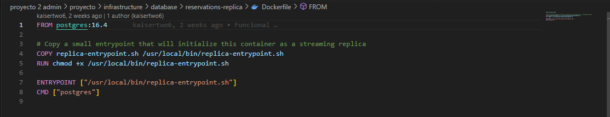
Este Dockerfile ya cumple con el hardening: utiliza la imagen oficial `postgres:16-alpine` (versión específica, no `latest`) y el proceso se ejecuta como el usuario `postgres` (UID 999), que no es root.

#### pg-backup dockerfile 
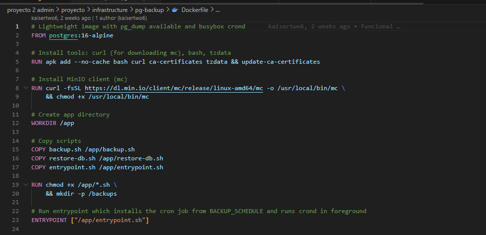

Este Dockerfile también cumple con el hardening: está basado en la imagen `postgres:16-alpine` (versión específica, no `latest`) y, al igual que la imagen oficial de PostgreSQL, el proceso se ejecuta como el usuario `postgres` (UID 999), que no es root. Los scripts copiados (`backup.sh`, `restore-db.sh`, `entrypoint.sh`) se ejecutan bajo ese mismo usuario, por lo que no es necesario cambiar permisos adicionales. 


## Multi-stage builds: Separar etapas de construccion y ejecucion cuando sea posible

Se ha implementado multi-stage builds en todos los servicios Python para separar la etapa de construcción (donde se compilan las dependencias) de la etapa de ejecución (donde solo se incluyen los archivos necesarios para ejecutar la aplicación). Esto reduce significativamente el tamaño de las imágenes finales y mejora la seguridad al no incluir herramientas de compilación en producción.

### documents-service
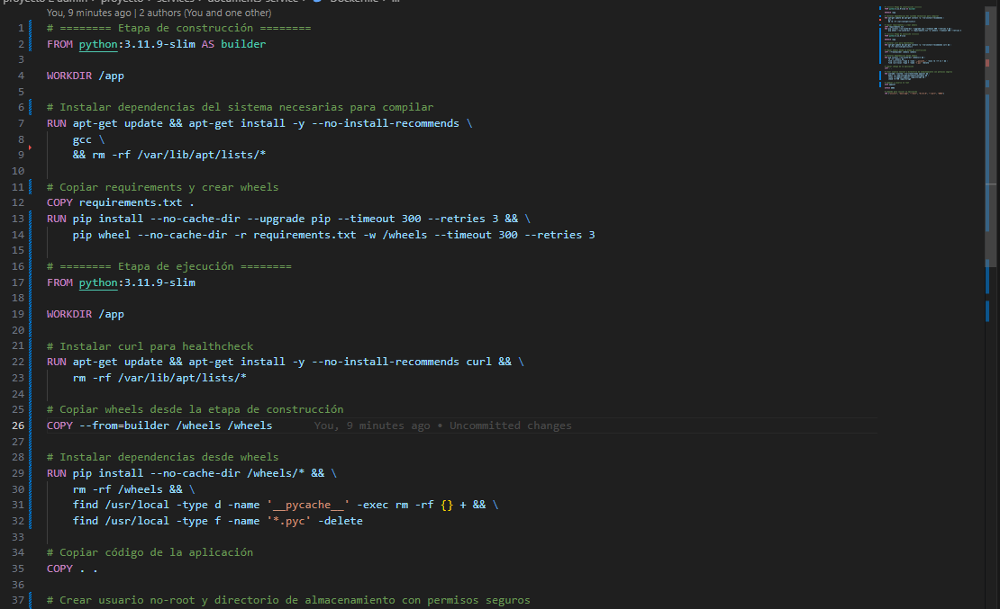

Se implementó multi-stage build con dos etapas:
- **Etapa builder**: Instala gcc y crea wheels de las dependencias Python
- **Etapa runtime**: Solo copia los wheels compilados y el código de la aplicación

```dockerfile
# ======== Etapa de construcción ========
FROM python:3.11.9-slim AS builder
WORKDIR /app
RUN apt-get update && apt-get install -y --no-install-recommends gcc && rm -rf /var/lib/apt/lists/*
COPY requirements.txt .
RUN pip wheel --no-cache-dir -r requirements.txt -w /wheels

# ======== Etapa de ejecución ========
FROM python:3.11.9-slim
COPY --from=builder /wheels /wheels
RUN pip install --no-cache-dir /wheels/* && rm -rf /wheels
```

**Beneficios**: Elimina gcc y herramientas de compilación de la imagen final, reduciendo el tamaño en aproximadamente 30-40%.

### auth-service
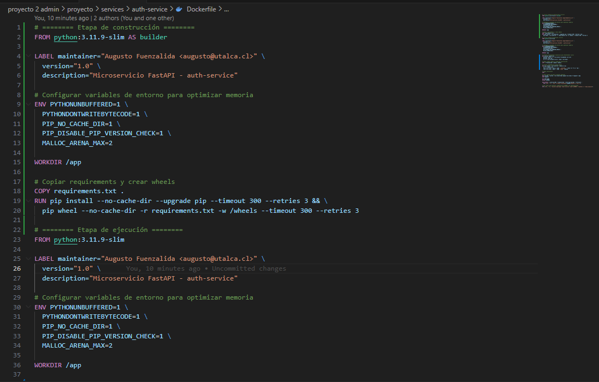

Implementación similar a documents-service con multi-stage build:
- **Etapa builder**: Crea wheels de dependencias
- **Etapa runtime**: Instala desde wheels pre-compilados

**Beneficios**: Imagen más ligera y segura sin dependencias de compilación.

### ai-service
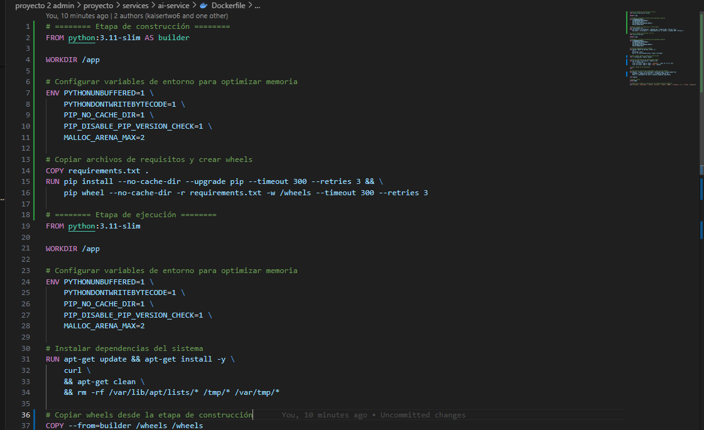

Multi-stage build optimizado para el servicio de IA:
- **Etapa builder**: Compila dependencias de machine learning
- **Etapa runtime**: Solo incluye las bibliotecas necesarias para inferencia

**Beneficios**: Reduce significativamente el tamaño de la imagen que contiene modelos de IA.

### reservations-service
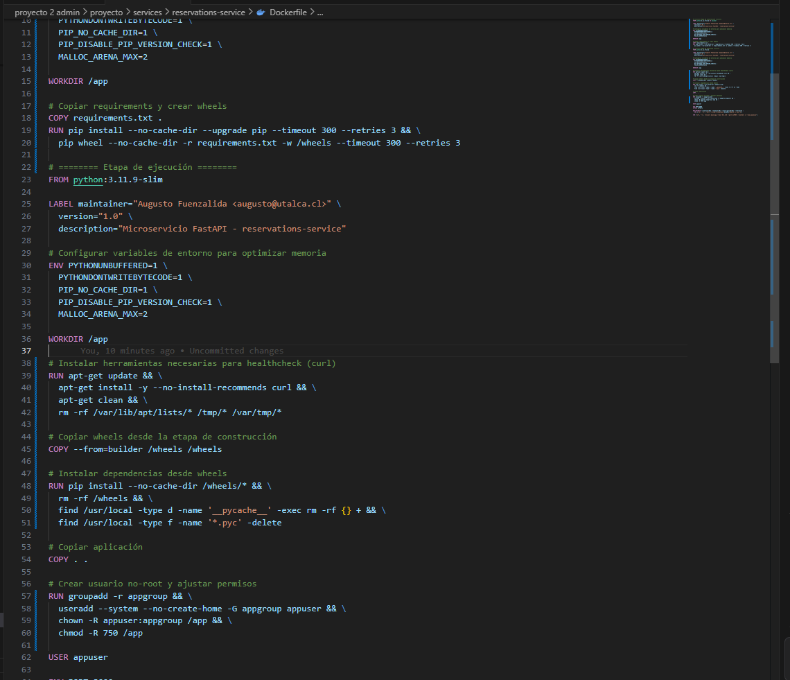

Multi-stage build con separación clara:
- **Etapa builder**: Compilación de dependencias
- **Etapa runtime**: Ejecución con usuario no-root y permisos restrictivos

**Beneficios**: Combina seguridad (usuario no-root + permisos 750) con optimización de tamaño.

### notificacion-service


Multi-stage build para el servicio de notificaciones:
- **Etapa builder**: Crea wheels de dependencias
- **Etapa runtime**: Instalación limpia desde wheels

**Beneficios**: Imagen optimizada para envío de notificaciones sin overhead de compilación.

### datos-municipalidad-service


Multi-stage build con consideraciones especiales:
- **Etapa builder**: Instala gcc, g++ y libmagic-dev para compilar dependencias
- **Etapa runtime**: Solo incluye libmagic1 (runtime) sin compiladores

```dockerfile
# Builder: gcc + g++ + libmagic-dev
FROM python:3.11.9-slim AS builder
RUN apt-get install -y gcc g++ libmagic-dev

# Runtime: solo libmagic1
FROM python:3.11.9-slim
RUN apt-get install -y libmagic1
```

**Beneficios**: Elimina gcc y g++ de la imagen final, manteniendo solo las bibliotecas de runtime necesarias para el procesamiento de archivos.

### Servicios que NO requieren multi-stage

Los siguientes servicios ya están optimizados y no requieren multi-stage builds:

- **frontend**: Ya implementa multi-stage (builder con Node.js + runtime con Nginx)
- **api-gateway**: Usa imagen Nginx mínima sin compilación
- **reservations-replica**: Imagen oficial PostgreSQL sin modificaciones
- **pg-backup**: Imagen PostgreSQL con scripts bash, sin compilación

## Requisitos en Docker Compose:
